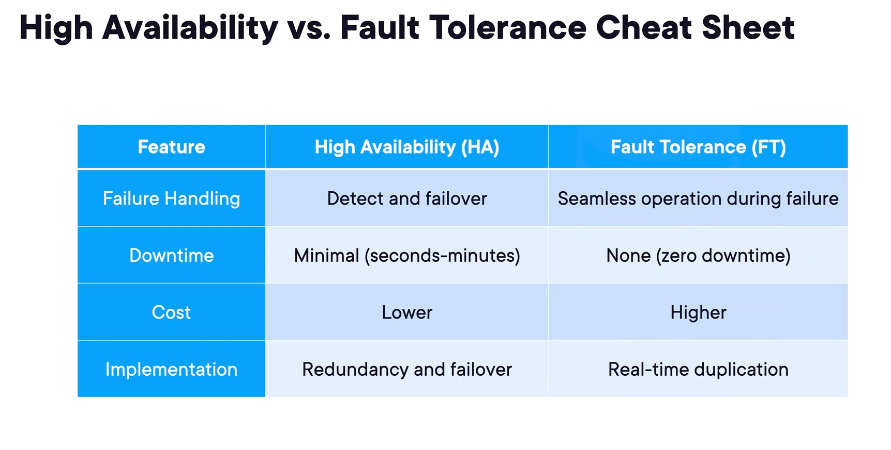

# 1 - Responsibility in AWS: The Shared Responsibility Model

## Sujet du cours

Présentation du **modèle de responsabilité partagée** (*Shared Responsibility Model*) d'AWS : une répartition claire des responsabilités en matière de sécurité et de conformité entre AWS et le client.

---

## Concepts clés

| Concept                                     | Responsable |
|---------------------------------------------|-------------|
| **Sécurité dans le cloud** (*in the cloud*) | **Client**  |
| **Sécurité du cloud** (*of the cloud*)      | **AWS**     |

---

## Explications essentielles

### Responsabilités du client (sécurité *dans* le cloud)

- **Chiffrement des données** : le client doit activer et utiliser les fonctionnalités de chiffrement proposées par AWS pour protéger ses données au repos.
- **Sauvegarde des données** : le client est responsable de mettre en place ses propres sauvegardes selon ses exigences de conformité, même si AWS offre des services à haute disponibilité.
- **Contrôle des accès et des autorisations** : le client gère l'authentification, les accès et les autorisations. Il est essentiel de bien comprendre la différence entre ces trois notions.
- **Gestion des systèmes d'exploitation, configurations réseau et pare-feu** : le client administre ces éléments au niveau de ses instances et services.

### Responsabilités d'AWS (sécurité *du* cloud)

- **Maintenance et mise à jour des logiciels** qui font tourner tous les services AWS.
- **Sécurité physique et redondance** des infrastructures (contrôle des accès physiques aux data centers, équipements de secours en cas de panne).
- **Maintenance du matériel** (*hardware*) sous-jacent sur lequel reposent tous les services cloud.
- **Infrastructure mondiale** : AWS est responsable des Régions, Zones de disponibilité (AZ) et Edge Locations.

---

## Points à retenir

- La sécurité est une **responsabilité partagée** : ni uniquement AWS, ni uniquement le client.
- Moyen mnémotechnique : **"in the cloud" = client / "of the cloud" = AWS**.
- AWS fournit les outils et fonctionnalités, mais c'est au client de les **activer et les utiliser**.
- Bien maîtriser la distinction entre **authentification**, **accès** et **autorisation** est crucial pour l'examen.

# 2 - The Pillars of the Well-Architected Framework

## Sujet du cours

Présentation du **Well-Architected Framework** d'AWS : un ensemble de principes à appliquer à tous les workloads AWS, organisé en **six piliers** fondamentaux à maîtriser pour l'examen.

---

## Concepts clés

| Pilier                     | Question centrale                                                                    |
|----------------------------|--------------------------------------------------------------------------------------|
| **Operational Excellence** | Mon architecture fonctionne-t-elle et continuera-t-elle à fonctionner ?              |
| **Security**               | Mon système fonctionne-t-il uniquement comme prévu, sans faille ?                    |
| **Cost Optimization**      | Est-ce que je dépense uniquement ce qui est nécessaire ?                             |
| **Reliability**            | Mon système fonctionne-t-il de manière cohérente et peut-il se rétablir rapidement ? |
| **Performance Efficiency** | Est-ce que j'élimine les goulots d'étranglement et réduis les gaspillages ?          |
| **Sustainability**         | Est-ce que je minimise l'impact environnemental de mes workloads ?                   |

---

## Explications essentielles

### 1. Operational Excellence — Excellence opérationnelle
- Soutenir le développement des applications et de l'infrastructure dans la durée.
- Exécuter les workloads efficacement (bons services, bonnes ressources, pas de gaspillage).
- Collecter des métriques pour mesurer l'efficacité opérationnelle.
- Améliorer en continu les processus pour délivrer de la valeur métier.
- **Exemples** : infrastructure as code, changements petits et fréquents, utilisation de services managés.

### 2. Security — Sécurité
- Protéger les données (chiffrement, contrôle des accès et autorisations).
- Protéger les systèmes sous-jacents et les assets clients.
- **Exemples** : traçabilité des accès, sécurité en couches (modèle "oignon"), chiffrement en transit (TLS) et au repos (AES-256), isolation des données.

### 3. Cost Optimization — Optimisation des coûts
- Délivrer de la valeur métier au coût le plus bas possible, sans gaspillage.
- **Exemples** : modèle de consommation à la demande, remises sur volume, utilisation de services managés pour éviter la gestion d'infrastructure.

### 4. Reliability — Fiabilité
- Garantir un fonctionnement cohérent et sans erreurs intermittentes.
- Assurer une récupération rapide en cas de panne.
- **Exemples** : auto-scaling groups, enregistrements DNS avec failover, tests de récupération, scaling horizontal pour les pics de trafic.

### 5. Performance Efficiency — Efficacité des performances
- Utiliser les ressources de calcul adaptées au workload.
- Maintenir l'efficacité face aux pics de charge.
- **Exemples** : architectures serverless (ex. Lambda), déploiement multi-régions pour les utilisateurs globaux, tests de charge réguliers.

### 6. Sustainability — Durabilité
- Réduire la consommation énergétique et maximiser l'utilisation des ressources provisionnées.
- Éviter les ressources de calcul inutilisées.
- **Exemples** : scaling à la demande plutôt que surcapacité permanente, services managés, simplification de l'architecture si possible.

---

## Points à retenir

- Le Well-Architected Framework comporte **6 piliers** : Operational Excellence, Security, Cost Optimization, Reliability, Performance Efficiency, Sustainability.
- Ces piliers sont **interdépendants** : ex. utiliser le bon type de ressource améliore à la fois la performance et les coûts.
- **Règle d'or** : ne pas réinventer la roue — privilégier les services managés AWS quand c'est pertinent.
- Ces piliers servent de **grille de lecture** pour répondre aux questions de scénario à l'examen.

# 3- The AWS Well-Architected Tool

## Sujet du cours

Présentation du **AWS Well-Architected Tool** : un service AWS permettant de mesurer et d'évaluer dans quelle mesure une architecture respecte les bonnes pratiques des six piliers du Well-Architected Framework.

---

## Explications essentielles

Le Well-Architected Tool aide à :
1. **Outil de mesure** de la conformité d'une architecture aux piliers du Well-Architected Framework.
2. **Processus cohérent** pour documenter, évaluer et améliorer ses workloads AWS.
3. **Documenter les décisions d'architecture** : justifier le choix d'un type de calcul, d'un type de stockage, etc.
4. **Fournir des recommandations d'amélioration** : identifier les points avec lesquels un workload pourrait être mieux optimisé.
5. **Concevoir des solutions** fiables, sécurisées, performantes et économiques — en cohérence directe avec les piliers du Well-Architected Framework.

---

## Points à retenir

- C'est un **service AWS natif**, pas un concept théorique : il s'utilise directement dans la console AWS.
- Son rôle principal est de **vérifier l'alignement** d'une architecture avec les meilleures pratiques AWS.
- À retenir pour l'examen : le Well-Architected Tool sert à **s'assurer que les piliers sont respectés** dans une architecture existante ou en cours de conception.

# 4- Understanding High Availability and Fault Tolerance

## Sujet du cours

Distinction entre **haute disponibilité** (*High Availability*) et **tolérance aux pannes** (*Fault Tolerance*), ainsi que présentation des concepts **RTO** et **RPO**, essentiels pour concevoir des architectures résilientes sur AWS.

---

## Concepts clés

| Concept                    | Objectif d'uptime | Comportement en cas de panne                                  |
|----------------------------|-------------------|---------------------------------------------------------------|
| **High Availability (HA)** | ~99,99%           | Interruption brève, récupération rapide                       |
| **Fault Tolerance (FT)**   | 100%              | Aucune interruption, basculement invisible pour l'utilisateur |
| **RTO**                    | —                 | Temps maximum acceptable pour restaurer le système            |
| **RPO**                    | —                 | Quantité maximale acceptable de données perdues (en temps)    |

---

## Explications essentielles

### High Availability — Haute disponibilité
- Les systèmes sont conçus pour rester **opérationnels le plus longtemps possible**.
- Les pannes entraînent un **temps d'arrêt minimal** et de brèves interruptions.
- Repose sur la **redondance** et des mécanismes de **failover** (potentiellement auto-guérissant).
- Objectif typique : **99,99% d'uptime**.

### Fault Tolerance — Tolérance aux pannes
- Les systèmes continuent de fonctionner **même si un ou plusieurs composants tombent en panne**.
- Le basculement est **automatique et transparent** : les utilisateurs ne remarquent rien.
- Objectif : **100% de uptime**.

> **Différence clé** : la HA tolère une courte interruption ; la FT n'en tolère aucune.

### RTO — Recovery Time Objective
- Temps maximum acceptable pour **remettre le système en ligne** après une panne.
- Mesuré en **unités de temps** (ex. : "le système doit être restauré en moins de 5 minutes").

### RPO — Recovery Point Objective
- Quantité maximale de **données perdues acceptables**, exprimée en temps.
- Correspond à l'âge des données que l'on peut se permettre de perdre (ex. : "on accepte de perdre au maximum 10 heures de données").

---

## Exemples importants

- **High Availability** : application web avec un **load balancer** et un **auto-scaling group** répartis sur plusieurs zones de disponibilité (AZ).
- **Fault Tolerance** : base de données utilisant **Amazon Aurora** en mode *Global Database* avec réplication synchrone **multi-région**.

> Règle générale : les **AZ** gèrent la haute disponibilité ; les **régions** gèrent la tolérance aux pannes et les failovers.

---

## Points à retenir

- **HA ≠ FT** : la tolérance aux pannes est un niveau supérieur de résilience, sans aucune interruption de service.
- **RTO** = combien de temps peut-on rester hors ligne ?
- **RPO** = combien de données peut-on se permettre de perdre ?
- Ces quatre concepts (HA, FT, RTO, RPO) sont **incontournables pour l'examen**.