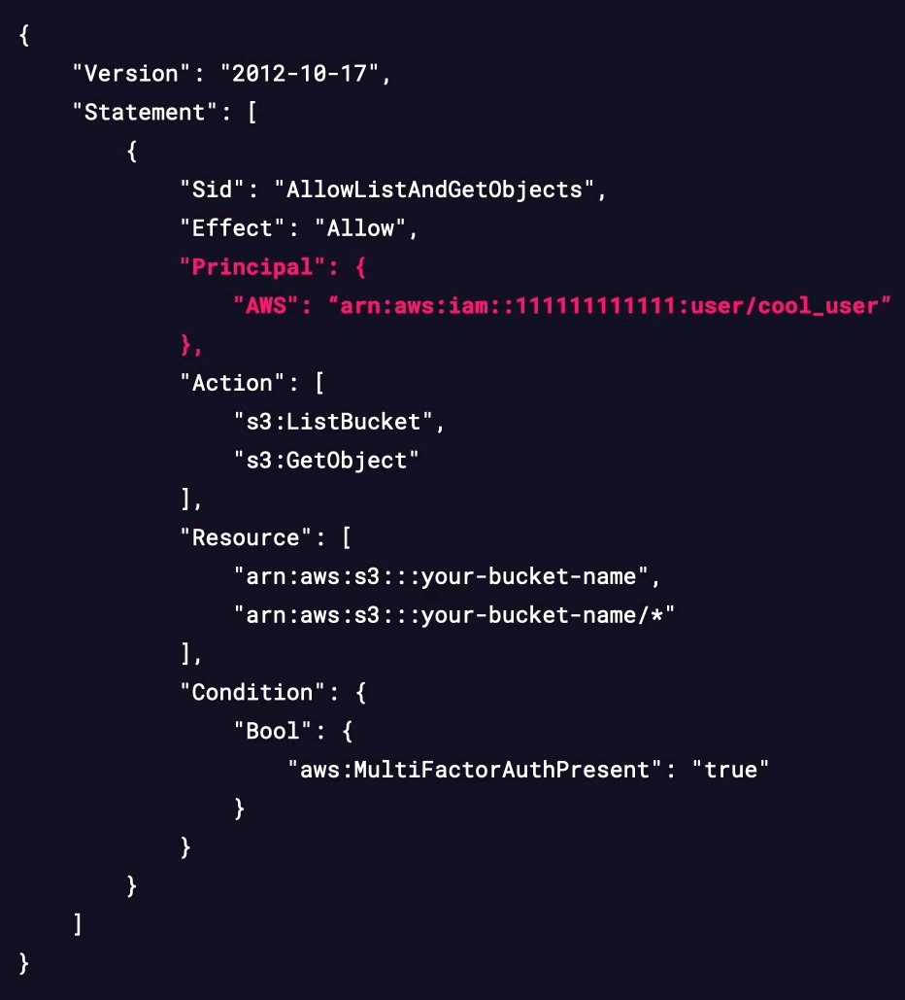

# 1- AWS IAM Users and Groups

## Sujet du cours

Introduction aux **utilisateurs IAM** et aux **groupes IAM** : définitions, méthodes d'authentification, gestion des permissions et règles importantes à connaître pour l'examen.

---

## Concepts clés

| Concept                    | Définition                                                                                    |
|----------------------------|-----------------------------------------------------------------------------------------------|
| **Utilisateur IAM**        | Entité représentant un humain ou un compte de service nécessitant des credentials long terme. |
| **Groupe IAM**             | Collection d'utilisateurs IAM partageant les mêmes permissions.                               |
| **Permission policy**      | Document définissant ce qu'un utilisateur ou groupe peut ou ne peut pas faire.                |
| **Credentials long terme** | Username/password (console) ou Access Keys (accès programmatique).                            |

---

## Explications essentielles

### Utilisateurs IAM
- Représentent une **personne ou un service applicatif** ayant besoin d'accéder au compte AWS.
- S'authentifient de deux façons :
    - **Username + password** : pour la connexion à la console AWS.
    - **Access Keys (clé d'accès statique)** : pour l'accès programmatique (CLI, SDK).
- Les permissions sont attribuées via des **permission policies**.

### Groupes IAM
- Permettent de **simplifier la gestion des permissions** : on assigne les policies au groupe, et tous les membres en héritent automatiquement.
- Un utilisateur peut appartenir à **plusieurs groupes simultanément** et cumule les permissions de chaque groupe.
- **Règle importante** : il est **impossible d'imbriquer un groupe dans un autre groupe**.

---

## Points à retenir

- **IAM user** = identité long terme pour humain ou service ; **IAM group** = regroupement d'utilisateurs pour simplifier les permissions.
- Toujours préférer l'attribution de permissions **via des groupes** plutôt qu'en one-to-one sur chaque utilisateur.
- Un utilisateur dans plusieurs groupes **cumule toutes les permissions** de ces groupes.
- **Pas de groupes imbriqués** — à retenir absolument pour l'examen.
- Les **access keys** et les **permission policies** seront détaillés dans les modules suivants.

# 2- Demo: Creating an Admin IAM User and Group

## Sujet du cours

Démonstration pratique de la **création d'un utilisateur IAM**, d'un **groupe IAM** et de l'**attribution de permissions via le groupe** dans la console AWS.

---

## Méthodes / Raisonnements

### 1. Créer un utilisateur IAM
1. Dans la console AWS, rechercher **IAM** → *Access management* → **Users** → *Create user*.
2. Définir un **nom d'utilisateur** (ex. `fake_admin`).
3. Activer l'**accès console** et choisir entre mot de passe autogénéré ou personnalisé.
4. **Bonne pratique** : cocher *Require password reset at next sign-in* pour forcer l'utilisateur à choisir son propre mot de passe dès la première connexion.
5. Ignorer l'étape permissions lors de la création (les permissions seront attribuées via le groupe).
6. Copier le **mot de passe généré** et l'**URL de connexion** affichés après la création.

### 2. Créer un groupe IAM et assigner des permissions
1. Aller dans **User groups** → *Create group*.
2. Donner un nom au groupe (ex. `fake_admin_group`).
3. **Ajouter l'utilisateur** au groupe lors de la création.
4. **Attacher une permission policy** au groupe (ex. `AdministratorAccess`).
5. Cliquer sur *Create user group*.

### 3. Vérifier l'héritage des permissions
- Se déconnecter et se reconnecter avec le nouvel utilisateur via l'URL de connexion copiée.
- L'utilisateur hérite automatiquement de toutes les permissions attachées au groupe.

---

## Points à retenir

- **Toujours attribuer les permissions via des groupes** plutôt que directement sur les utilisateurs — meilleure pratique pour la scalabilité et la maintenance.
- Les permissions du groupe sont **héritées automatiquement** par tous les membres du groupe.
- La **réinitialisation du mot de passe à la première connexion** est une bonne pratique de sécurité à activer en production.
- Un utilisateur sans groupe ni policy attachée **n'a aucune permission** dans le compte.
- Les policies (comme `AdministratorAccess`) seront détaillées dans les modules suivants.

# 3- IAM Policies

## Sujet du cours

Présentation des **politiques IAM** (*IAM Policies*) : définition, types principaux et règles fondamentales de fonctionnement des permissions dans AWS.

---

## Concepts clés

| Type de politique           | Description                                                                        |
|-----------------------------|------------------------------------------------------------------------------------|
| **Identity-based**          | Attachée à un utilisateur, groupe ou rôle IAM.                                     |
| **Resource-based**          | Attachée directement à une ressource AWS (ex. bucket S3, clé KMS).                 |
| **Managed policy**          | Politique standalone, réutilisable, avec un ARN propre.                            |
| **Inline policy**           | Politique embarquée directement dans une identité ou ressource — non réutilisable. |
| **AWS managed policy**      | Créée et gérée par AWS, utilisable par tous (ex. `AdministratorAccess`).           |
| **Customer managed policy** | Créée et gérée par le client, personnalisable librement.                           |

---

## Explications essentielles

### Règle fondamentale des permissions IAM
> **Si une action n'est pas explicitement autorisée, elle est implicitement refusée.**

Par défaut, un utilisateur IAM n'a **aucune permission**. Toute permission doit être explicitement accordée via une policy.

### Identity-based policies
- S'attachent à des **utilisateurs, groupes ou rôles** IAM.
- Rédigées en **JSON**.
- Deux formes :
  - **Managed** : réutilisable, possède un ARN. Deux sous-types :
    - *AWS managed* : gérée par AWS, pas d'ID de compte dans l'ARN.
    - *Customer managed* : créée par le client — bonne pratique : partir d'une AWS managed policy et l'ajuster.
  - **Inline** : attachée à une seule identité, non réutilisable. Supprimée si l'identité est supprimée. Réservée aux cas très spécifiques.

### Resource-based policies
- S'attachent à des **ressources AWS** (ex. bucket S3, clé KMS).
- Rédigées en **JSON**.
- Toutes considérées comme des **inline policies** (supprimées avec la ressource).
- Permettent de définir quel **principal IAM** (utilisateur, compte) peut accéder à la ressource.
- Utiles pour l'**accès cross-account** : on peut y spécifier un autre compte AWS comme principal autorisé.

---

## Points à retenir

- **Deny implicite par défaut** : sans policy explicite, toute action est refusée — règle critique pour l'examen.
- **Managed vs Inline** : les managed policies sont réutilisables et préférées ; les inline sont one-to-one et pour des cas très précis.
- **Resource-based policies** = accès cross account simplifié et contrôle fin sur une ressource spécifique.
- Les 6 types de policies existent (identity, resource-based, permissions boundaries, SCP, ACL, session), mais **identity-based et resource-based sont les deux prioritaires** à maîtriser pour l'examen.


# 4- Exploring an IAM Policy

## Sujet du cours

Analyse détaillée de la **structure d'une politique IAM** en JSON : description de chaque champ, son caractère obligatoire ou optionnel, et son rôle dans la définition des permissions.

---

## Concepts clés — Structure d'une IAM Policy (JSON)



| Champ         | Obligatoire      | Rôle                                                                       |
|---------------|------------------|----------------------------------------------------------------------------|
| **Version**   | ✅ Oui           | Version du langage de politique (valeur fixe).                             |
| **Statement** | ✅ Oui           | Liste des déclarations de permissions (objets allow/deny).                 |
| **Sid**       | ❌ Non           | Identifiant lisible pour chaque statement (ex. `AllowListAndGetObjects`).  |
| **Effect**    | ✅ Oui           | `Allow` ou `Deny` — définit si les actions sont autorisées ou refusées.    |
| **Principal** | Dépend du type   | Identité IAM concernée (obligatoire pour les resource-based policies).     |
| **Action**    | Dépend du type   | Liste des appels API autorisés ou refusés (ex. `s3:ListBucket`).           |
| **Resource**  | Dépend du type   | ARN des ressources AWS auxquelles les actions s'appliquent.                |
| **Condition** | ❌ Non           | Conditions supplémentaires pour affiner les permissions.                   |

---

## Explications essentielles

### Exemple analysé : resource-based policy S3
- **Principal** : utilisateur IAM `cool_user` (identifié par son ARN).
- **Action** : `s3:ListBucket` et `s3:GetObject` — actions spécifiques à l'API S3.
- **Resource** : deux ARNs S3 ciblés par ces permissions.
- **Condition** : `MultiFactorAuthPresent: true` — les actions ne sont autorisées que si le MFA est actif lors de l'appel.

### Le champ Condition
Permet de personnaliser finement une policy. Exemples d'usages courants :
- Exiger la présence du **MFA**.
- Restreindre les appels à des **plages d'IP sources** spécifiques.
- Passer un **identifiant externe** pour la validation.

---

## Points à retenir

- Une policy IAM est toujours un **document JSON** avec une structure fixe et prévisible.
- **Effect + Action + Resource** sont les trois champs centraux qui définissent concrètement une permission.
- Le champ **Condition** est puissant pour renforcer la sécurité sans créer de policies séparées.
- Les **actions sont liées au service** : les actions S3 commencent par `s3:`, les actions EC2 par `ec2:`, etc.
- Savoir **lire et interpréter une policy JSON** est une compétence directement testée à l'examen.

# 5- Demo: Creating an IAM Policy

## Sujet du cours

Démonstration pratique de la **création d'une politique IAM personnalisée** (customer managed, identity based), de son **attachement à un groupe IAM** et de la **vérification des permissions** en conditions réelles.

---

## Méthodes / Raisonnements

### 1. Créer une policy IAM personnalisée
1. Dans la console IAM → **Policies** → *Create policy*.
2. Choisir l'éditeur **JSON** (recommandé : meilleure transférabilité vers l'infrastructure as code).
3. Coller le document JSON de la policy (ex. policy read-only IAM).
4. Cliquer sur **Next**, donner un **nom** et une description optionnelle à la policy.
5. Cliquer sur **Create policy**.

> La policy créée est une **customer managed policy** : elle possède son propre ARN et peut être réutilisée sur plusieurs identités.

### 2. Attacher la policy à un groupe
1. Aller dans **User groups** → sélectionner le groupe cible.
2. Onglet **Permissions** → *Add permissions* → *Attach policies*.
3. Filtrer par **Customer managed** pour retrouver la policy créée.
4. Sélectionner et attacher la policy.

### 3. Tester les permissions
- Se déconnecter et se reconnecter avec un utilisateur membre du groupe.
- **Vérifier les accès autorisés** : lecture des ressources IAM (voir les groupes, utilisateurs, policies).
- **Vérifier les accès refusés** : toute tentative d'écriture ou de suppression → message *"You are not authorized"*.

---

## Exemples importants

- **Policy testée** : read-only IAM — autorise `Get`, `List` sur toutes les ressources IAM, mais interdit toute modification ou suppression.
- La ressource est définie comme `*` (toutes les ressources) dans la démo pour simplifier — en production, il est recommandé de **restreindre aux ressources spécifiques**.

---

## Points à retenir

- Toujours créer les policies en **JSON** pour une meilleure maîtrise et portabilité.
- Une **customer managed policy** dispose d'un ARN et est **réutilisable** sur plusieurs identités ou groupes.
- Après attachement au groupe, **tous les membres héritent automatiquement** des permissions.
- Tester systématiquement les permissions après création pour valider le comportement attendu.
- Le champ `Resource: "*"` est pratique en démo mais **non recommandé en production** — toujours restreindre aux ressources nécessaires.

# 6- Demo: Creating an IAM Inline Policy

## Sujet du cours

Démonstration pratique de la **création d'une inline policy IAM**, illustration de son comportement spécifique (non réutilisable, liée à une identité) et de ce qui se passe lors de la suppression de l'identité associée.

---

## Méthodes / Raisonnements

### 1. Créer un utilisateur IAM sans permissions
1. IAM → **Users** → *Create user*.
2. Ne pas assigner de groupe ni de permissions — les permissions seront ajoutées via une inline policy.

### 2. Créer une inline policy sur l'utilisateur
1. Ouvrir l'utilisateur → **Add permissions** → *Create inline policy*.
2. Basculer sur l'éditeur **JSON** et coller le document de policy.
3. Donner un nom à la policy et cliquer sur *Create policy*.

> La policy apparaît directement dans l'onglet de l'utilisateur — elle **n'existe pas en tant que ressource séparée**.

### 3. Vérifier le comportement de l'inline policy
- Aller dans **Policies** (menu principal IAM) : **la policy n'y est pas listée** — les inline policies ne sont pas référençables indépendamment.
- La policy n'est visible et modifiable **que depuis l'identité à laquelle elle est attachée**.

### 4. Supprimer l'utilisateur → suppression automatique de la policy
- En supprimant l'utilisateur, **la policy inline est supprimée avec lui** — elle n'existe plus nulle part.

---

## Points à retenir

- Une **inline policy** est liée en one-to-one à une identité : elle **n'a pas d'ARN propre** et n'est **pas réutilisable**.
- Elle n'apparaît **pas dans la liste des policies** IAM — uniquement visible dans l'identité à laquelle elle est attachée.
- **Suppression de l'identité = suppression automatique de la policy** associée.
- À réserver aux **cas très spécifiques** nécessitant une permission unique et non partageable.
- Pour la majorité des cas, préférer les **managed policies** (AWS ou customer) pour leur réutilisabilité et leur traçabilité.


# 7- Understanding AWS IAM Access Keys

## Sujet du cours

Présentation des **clés d'accès IAM** (*Access Keys*) : leur rôle, leur composition, leurs règles d'utilisation et les bonnes pratiques de sécurité associées.

---

## Concepts clés

| Composant             | Rôle                  | Analogie                         |
|-----------------------|-----------------------|----------------------------------|
| **Access Key ID**     | Identifiant de la clé | Similaire à un nom d'utilisateur |
| **Secret Access Key** | Clé secrète associée  | Similaire à un mot de passe      |

---

## Explications essentielles

### Qu'est-ce qu'une access key ?
- Paire de credentials **long terme** destinée aux **utilisateurs IAM** et au **compte root**.
- Utilisée pour **signer des requêtes programmatiques** via le CLI AWS ou un SDK (Python, Java, etc.).
- Les deux composants (**Access Key ID + Secret Access Key**) sont **toujours requis ensemble** pour s'authentifier.

### Règle critique : Secret Access Key visible une seule fois
- Le Secret Access Key n'est affiché **qu'au moment de la création**.
- Il doit être **téléchargé ou sauvegardé immédiatement** — il ne pourra plus jamais être récupéré ensuite.
- Si perdu : la paire de clés doit être **supprimée et recréée**.

---

## Points à retenir

- Les access keys sont l'équivalent d'un **username/password pour l'accès programmatique** — à protéger avec le même niveau de vigilance.
- **Ne jamais créer d'access keys pour le compte root** (rappel du module précédent).
- Le Secret Access Key est **plus long et plus complexe** que l'Access Key ID.
- En cas de compromission d'une clé, la **désactiver ou la supprimer immédiatement** dans IAM.

# 8- Demo: Creating Access Keys

## Sujet du cours

Démonstration pratique de la **création de clés d'accès IAM**, de leur **configuration dans le CLI AWS** et de la gestion du cycle de vie des clés (désactivation, réactivation, suppression).

---

## Méthodes / Raisonnements

### 1. Créer une paire de clés d'accès
1. IAM → **Users** → sélectionner l'utilisateur → **Security credentials** → *Create access key*.
2. Choisir le **cas d'usage** (ex. CLI).
3. Ajouter une **description** pour identifier l'usage des clés (bonne pratique).
4. Cliquer sur *Create access key*.
5. **Copier ou télécharger immédiatement** le Secret Access Key (CSV disponible) — il ne sera plus accessible après cette étape.

### 2. Configurer le CLI avec les nouvelles clés
```bash
aws configure
```
- Entrer l'**Access Key ID** puis le **Secret Access Key**.
- Accepter ou définir la région et le format de sortie.

### 3. Tester les clés
```bash
aws iam list-users
```
Retourne la liste des utilisateurs IAM du compte — confirme que les clés fonctionnent correctement.

### 4. Désactiver / Réactiver / Supprimer des clés
- **Désactiver** : IAM → Security credentials de l'utilisateur → *Deactivate* sur la paire concernée.
  - Toute requête signée avec ces clés retourne immédiatement une erreur d'authentification.
- **Réactiver** : même menu → *Activate* — les clés redeviennent fonctionnelles instantanément.
- **Supprimer** : action irréversible, à faire après confirmation que les clés ne sont plus nécessaires.

---

## Points à retenir

- Le **Secret Access Key n'est visible qu'à la création** — toujours le sauvegarder immédiatement.
- En cas de **clés compromises** : les **désactiver immédiatement** pour stopper tout accès non autorisé, puis analyser avant de supprimer.
- La **désactivation est réversible** ; la suppression est définitive.
- Ajouter une **description** à chaque paire de clés pour faciliter leur gestion et identification.
- Un utilisateur IAM peut avoir au maximum **2 paires de clés actives** simultanément dans AWS.

# 9- AWS IAM Credential Reports

## Sujet du cours

Présentation des **rapports de credentials IAM** : leur contenu, leur utilité pour l'audit et la conformité, et leur fréquence de mise à jour.

---

## Concepts clés

- **IAM Credential Report** : rapport générable à la demande listant tous les utilisateurs IAM du compte avec le statut de leurs credentials.

---

## Explications essentielles

### Contenu du rapport
- Statut des **mots de passe** des utilisateurs IAM.
- Statut des **paires de clés d'accès** (actives, inactives, absentes).
- Présence ou absence du **MFA** pour chaque utilisateur.
- Et d'autres informations sur l'état des credentials.

### Cas d'usage
- **Audit et conformité** : obtenir rapidement une vue d'ensemble de l'état des identités IAM dans le compte.
- Sur l'examen : si un scénario demande une liste consolidée du statut des utilisateurs IAM → **credential report** est la réponse attendue.

### Fréquence de mise à jour
- Un rapport peut être **généré à tout moment**, mais les données ne sont **rafraîchies que toutes les 4 heures**.
- Exemple : un rapport généré à 12h00 et un autre à 14h00 contiendront les **mêmes données**. Un rapport généré à 17h00 contiendra des **données mises à jour**.

---

## Points à retenir

- Le credential report est l'outil de référence pour **auditer rapidement l'état des utilisateurs IAM**.
- Données actualisées toutes les **4 heures maximum** — pas en temps réel.
- Utile pour vérifier qui n'a **pas activé le MFA** ou dont les **clés d'accès sont inactives**.


# 10- Demo: Creating an AWS IAM Credential Report

## Sujet du cours

Démonstration pratique de la **génération d'un rapport de credentials IAM**, de son contenu et de la validation concrète de la règle de rafraîchissement des données toutes les 4 heures.

---

## Méthodes / Raisonnements

### Générer et télécharger le rapport
1. Dans la console IAM → menu gauche → **Credential report**.
2. Cliquer sur **Download credentials report**.
3. Le rapport est téléchargé au format **CSV**.

### Contenu du rapport (par utilisateur)
Le rapport liste tous les utilisateurs du compte, y compris le root, avec notamment :
- **ARN** de l'utilisateur.
- **Date de création** du compte.
- Présence et statut d'un **mot de passe**.
- **Dernière utilisation** du mot de passe.
- Présence et statut des **clés d'accès**.
- Activation ou non du **MFA**.

---

## Exemples importants

### Démonstration de la règle des 4 heures
1. Un rapport est généré → `fake_admin` n'a pas de clés d'accès listées.
2. Une paire de clés est créée pour `fake_admin`.
3. Un nouveau rapport est immédiatement généré → les nouvelles clés **n'apparaissent pas encore**, car les données ont moins de 4 heures.
4. Conclusion : il faudrait attendre 4 heures après le dernier rapport pour voir les clés apparaître dans le prochain.

---

## Points à retenir

- Le rapport est un simple **fichier CSV** consultable dans n'importe quel tableur.
- Les données ne sont **rafraîchies que toutes les 4 heures** — les modifications récentes n'y figurent pas immédiatement.
- Idéal pour **auditer rapidement** l'état des mots de passe, clés d'accès et MFA de tous les utilisateurs.
- Sur l'examen : besoin d'audit ou de conformité sur les utilisateurs IAM → **credential report** est la réponse.


# 11- Module Summary and Exam Tips — IAM Users, Policies & Access Keys

## Sujet du cours

Récapitulatif des points essentiels du module sur les utilisateurs, groupes, politiques et clés d'accès IAM, avec les conseils clés pour l'examen.

---

## Points à retenir

### Groupes IAM
- Toujours **attribuer les permissions via des groupes** plutôt que directement sur les utilisateurs.
- Un groupe permet d'appliquer un même ensemble de permissions à des centaines d'utilisateurs en une seule action.

### Types de policies — Récapitulatif

| Type                         | Attachée à                                 | Réutilisable            | ARN propre                 |
|------------------------------|--------------------------------------------|-------------------------|----------------------------|
| **Identity-based (managed)** | Utilisateur, groupe, rôle                  | ✅                      | ✅                         |
| **Identity-based (inline)**  | Une seule identité                         | ❌                      | ❌                         |
| **Resource-based**           | Ressource AWS                              | ❌ (inline uniquement)  | ❌ (pas d'ARN IAM propre)  |
| **AWS managed**              | Identités IAM                              | ✅                      | ✅ (sans account ID)       |
| **Customer managed**         | Identités IAM                              | ✅                      | ✅ (avec account ID)       |
| **Inline**                   | Une seule identité (user, rôle, ressource) | ❌                      | ❌                         |


> **Notes :**
> - Une **Identity-based policy** peut être soit **managed** (AWS ou Customer), soit **inline**.
> - AWS managed et Customer managed sont des sous-types d'Identity-based managed policies.
> - Les Resource-based policies sont toujours inline — elles n'existent pas en version managed.
> - Une policy inline n'a pas d'ARN propre et ne peut pas être partagée entre plusieurs identités.

- **Managed > Inline** : préférer toujours les policies managées pour leur simplicité de gestion.
- Les **inline policies** sont réservées aux cas très spécifiques one-to-one.

### Ordre de priorité des permissions (à mémoriser absolument)
1. **Explicit Deny** → toujours prioritaire, écrase tout allow.
2. **Explicit Allow** → autorise l'action si aucun deny ne s'y oppose.
3. **Implicit Deny** → comportement par défaut ; tout ce qui n'est pas explicitement autorisé est refusé.

> Un utilisateur IAM nouvellement créé n'a **aucune permission** — tout est implicitement refusé.

## L'ordre d'évaluation des policies AWS

Par défaut, **tout est refusé**. AWS évalue les policies dans cet ordre :

---

#### 1. Explicit Deny ❌

Une règle `Deny` écrite noir sur blanc dans une policy.

- **Priorité absolue** — écrase n'importe quel `Allow`, peu importe d'où il vient.
- Même si 10 policies autorisent une action, **un seul Deny suffit** à la bloquer.
```json
{
  "Effect": "Deny",
  "Action": "s3:DeleteBucket",
  "Resource": "*"
}
```

---

#### 2. Explicit Allow ✅

Une règle `Allow` écrite dans une policy.

- L'action est autorisée **uniquement si** aucun Explicit Deny ne s'y oppose.
- Doit être présent quelque part (identity-based ou resource-based) pour qu'une action passe.
```json
{
  "Effect": "Allow",
  "Action": "s3:GetObject",
  "Resource": "*"
}
```

---

#### 3. Implicit Deny 🚫

Pas de règle du tout — ni Allow, ni Deny.

- C'est le **comportement par défaut d'AWS**.
- Si une action n'est explicitement autorisée nulle part, elle est **refusée silencieusement**.
- Aucune règle à écrire — c'est l'absence de Allow qui produit ce refus.

---

#### Résumé visuel
```
Action demandée
      │
      ▼
Explicit Deny ? ──── OUI ──→ ❌ REFUSÉ
      │
      NON
      │
      ▼
Explicit Allow ? ─── OUI ──→ ✅ AUTORISÉ
      │
      NON
      │
      ▼
Implicit Deny ──────────────→ ❌ REFUSÉ (par défaut)
```

---

> **En résumé :** AWS part du principe que tout est interdit. Tu dois explicitement autoriser
> ce que tu veux permettre, et un seul Deny suffit à tout bloquer.

### Lecture d'une policy JSON
Maîtriser chaque champ : `Version`, `Statement`, `Sid`, `Effect`, `Principal`, `Action`, `Resource`, `Condition`. La lecture et l'interprétation de policies JSON est **directement testée à l'examen**.

### Access Keys (credentials programmatiques)
- Accès **programmatique uniquement** (CLI, SDK) — pas d'accès console.
- Accès console = **username + password** uniquement.
- **Bonne pratique** : rotation régulière des clés et mots de passe (recommandation courante : tous les 90 jours).

### IAM Credential Reports
- Données rafraîchies toutes les **4 heures** maximum.
- Contient : statut des mots de passe, clés d'accès, MFA pour chaque utilisateur.
- Outil de référence pour l'**audit et la conformité** IAM.

---

## Conseils examen

- Si un scénario parle de **permissions overlapping** → appliquer l'ordre : Explicit Deny > Explicit Allow > Implicit Deny.
- Si un scénario demande un **audit des utilisateurs IAM** → réponse = **Credential Report**.
- Si un scénario mentionne un **accès programmatique** → réponse = **Access Keys** (jamais username/password).
- Savoir distinguer **AWS managed vs customer managed vs inline** policies pour choisir la bonne selon le contexte.