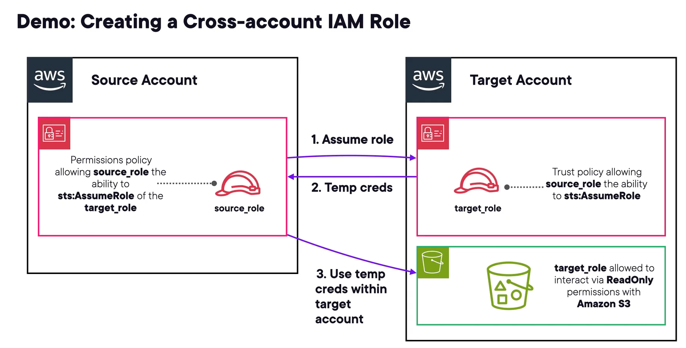
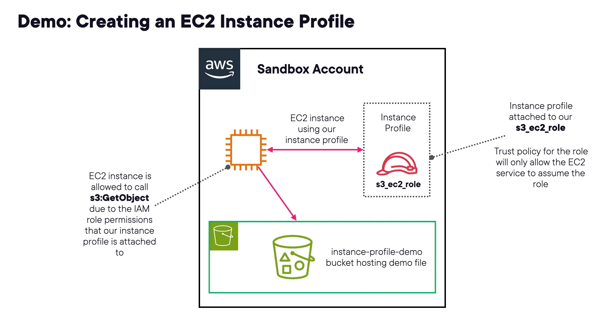

# 1- What Are IAM Roles?

## Sujet du cours

Introduction aux **rôles IAM** : définition, différences avec les utilisateurs IAM, types de rôles, cas d'usage courants et fonctionnement via **AWS STS** (Security Token Service).

---

## Concepts clés

| Concept                   | Définition                                                                                           |
|---------------------------|------------------------------------------------------------------------------------------------------|
| **IAM Role**              | Identité IAM assumable par des utilisateurs, services ou applications — sans credentials long terme. |
| **Temporary credentials** | Credentials générés dynamiquement, à durée limitée et renouvelés automatiquement (*rolling*).        |
| **AWS STS**               | Service backbone qui génère les credentials temporaires pour les rôles IAM.                          |
| **Session token**         | Composant obligatoire des credentials STS — requis pour authentifier l'utilisation d'un rôle.        |
| **Trust policy**          | Définit qui peut *assumer* le rôle (qui y a accès).                                                  |
| **Permission policy**     | Définit ce que le rôle peut *faire* (quelles actions sont autorisées).                               |

---

## Explications essentielles

### IAM Role vs IAM User
- Les rôles n'ont **pas de credentials long terme** (pas de username/password ni d'access keys permanentes).
- Les rôles sont **assumables par plusieurs entités** : utilisateurs, applications, services AWS, comptes externes.
- Les credentials générés sont **temporaires et renouvelés automatiquement**.

### Types de rôles IAM
- **Service-linked role** : permet à un service AWS d'accéder à d'autres ressources AWS de façon sécurisée.
- **Instance profile** : type de rôle attaché directement à une instance EC2 pour lui permettre d'utiliser des credentials de rôle.
- **Federated identity role** : permet à des identités externes (Google, Facebook, Amazon, etc.) d'assumer un rôle via une trust policy.

### AWS STS — Security Token Service
- Génère des credentials **temporaires et rolling** pour les rôles.
- Durée de vie configurable : de **15 minutes** (minimum) à **12 heures** (maximum).
- Utilisé avec **SAML federation** et **OIDC (OpenID Connect)**.
- Supporte des conditions comme le **MFA**.

### Structure des credentials STS (session)
- **AccessKeyId** + **SecretAccessKey** (comme des access keys classiques).
- **Expiration** : date et heure d'expiration des credentials.
- **Session token** : obligatoire — sans lui, les credentials sont invalides.

---

## Cas d'usage courants

- Permettre à une **fonction Lambda** d'accéder à une base DynamoDB.
- Permettre à une **instance EC2** d'accéder à des objets stockés dans S3.
- Permettre à un **autre compte AWS** (ex. auditeur tiers) d'accéder à votre compte de façon contrôlée.

---

## Points à retenir

- Un rôle se configure avec **deux types de policies** : trust policy (qui peut l'assumer) + permission policy (ce qu'il peut faire).
- Les credentials d'un rôle sont **toujours temporaires** — c'est la différence fondamentale avec un utilisateur IAM.
- Le **session token est obligatoire** pour utiliser des credentials de rôle STS.
- STS est le **mécanisme sous-jacent** de tous les rôles IAM — à connaître pour l'examen.

# 2- IAM Role Trust Policies

## Sujet du cours

Présentation des **trust policies** des rôles IAM : leur rôle, leur structure JSON et leur différence avec la permission policies.

---

## Concepts clés

| Concept               | Définition                                                                            |
|-----------------------|---------------------------------------------------------------------------------------|
| **Trust policy**      | Document JSON définissant **qui** est autorisé à assumer le rôle.                     |
| **Permission policy** | Document JSON définissant **ce que** le rôle peut faire.                              |
| **Principal**         | Entité autorisée à assumer le rôle (utilisateur IAM, rôle, compte root, service AWS). |
| **sts:AssumeRole**    | Action API requise pour assumer un rôle — clé à retenir pour l'examen.                |

---

## Explications essentielles

### Rôle de la trust policy
- Définit les **principes de confiance** : qui peut assumer le rôle.
- **Obligatoire** : sans trust policy, aucune entité ne peut assumer le rôle — il est inutilisable.
- Principes possibles : utilisateur IAM, autre rôle IAM, compte root AWS, service AWS.

### Structure d'une trust policy (JSON)

Suit le même format que les autres policies IAM :
- **Effect** : `Allow`
- **Principal** : identité autorisée à assumer le rôle (ex. ARN d'un utilisateur IAM).
- **Action** : `sts:AssumeRole` — l'unique action spécifique au trust policies.
- **Condition** (optionnel) : ex. `MultiFactorAuthPresent: true` pour exiger le MFA avant d'assumer le rôle.

### Différence avec une permission policy
- La **trust policy** contrôle l'*accès au rôle* (qui peut l'assumer).
- La **permission policy** contrôle ce que le rôle *peut faire* une fois assumé.
- Les deux sont nécessaires pour qu'un rôle soit pleinement fonctionnel.

---

## Points à retenir

- `sts:AssumeRole` est l'**action clé** à connaître pour les trust policies — directement testée à l'examen.
- Une trust policy **sans principal défini = rôle inutilisable**.
- Les conditions (ex. MFA requis) s'appliquent aussi aux trust policies, tout comme aux autres resource-based policies.
- Une trust policy est une **resource-based policy** attachée au rôle lui-même.


# 3- Demo: Creating an IAM Role and Trust Policy

## Sujet du cours

Démonstration pratique de la **création d'un rôle IAM avec une trust policy personnalisée**, de l'attachement d'une permission policy, et de l'**assumption du rôle** depuis un utilisateur IAM.

---

## Méthodes / Raisonnements

### 1. Préparer — Copier l'ARN de l'utilisateur
- IAM → **Users** → sélectionner l'utilisateur → copier son **ARN** (nécessaire pour la trust policy).

### 2. Créer le rôle IAM
1. IAM → **Roles** → *Create role*.
2. Choisir le **type d'entité de confiance** :

| Option                  | Usage                                                     |
|-------------------------|-----------------------------------------------------------|
| **AWS service**         | Permet à EC2, Lambda, etc. d'assumer le rôle.             |
| **AWS account**         | Permet à un compte AWS (même ou autre) d'assumer le rôle. |
| **Web identity**        | Identités externes (Google, Facebook, Amazon).            |
| **SAML 2.0**            | Annuaires d'entreprise (Azure AD, Microsoft AD).          |
| **Custom trust policy** | JSON manuel — utilisé dans cette démo.                    |

3. Sélectionner **Custom trust policy** et coller le JSON avec l'ARN de l'utilisateur comme principal.
4. Attacher une **permission policy** (ex. `AmazonS3FullAccess`).
5. Donner un **nom** et une description au rôle, puis créer.

### 3. Assumer le rôle
- Depuis la page du rôle, copier le **lien de switch role** fourni par la console.
- Coller le lien dans le navigateur → les champs se remplissent automatiquement.
- Optionnel : choisir une couleur d'affichage pour identifier visuellement le rôle actif.
- Cliquer sur **Switch role** → le rôle est assumé.

### 4. Comportement une fois le rôle assumé
- Les permissions de l'utilisateur IAM d'origine **ne sont plus actives**.
- Seules les **permissions du rôle** s'appliquent (ici : S3 Full Access uniquement).
- Accès refusé à tous les autres services.

### 5. Revenir à l'identité d'origine
- Menu compte (haut droite) → **Switch back** → retour aux permissions de l'utilisateur IAM initial.

---

## Points à retenir

- La **trust policy restreint l'accès au rôle** à un ARN spécifique — seul cet utilisateur peut l'assumer.
- Une fois le rôle assumé, les **permissions utilisateur sont remplacées** par celles du rôle — pas cumulées.
- Le **lien de switch role** dans la console simplifie l'assumption sans saisie manuelle.
- `sts:AssumeRole` est l'action sous-jacente lors de l'assumption du rôle.
- Différents types d'entités de confiance existent selon le cas d'usage (service, compte, SAML, web identity).

# 4- Demo: Creating a Cross-account IAM Role

## Sujet du cours

Démonstration pratique de la création d'un **rôle IAM cross-account** : permettre à un rôle dans un compte source d'assumer un rôle dans un compte cible pour accéder à des ressources S3 en lecture seule.

---

## Architecture de la solution


```
Compte Source (5371...)          Compte Cible (9750...)
┌─────────────────────┐          ┌──────────────────────────┐
│  source_role        │          │  target_role             │
│  Permission policy: │─────────▶│  Trust policy:           │
│  sts:AssumeRole     │  assume  │  → Autorise compte source│
│  → target_role ARN  │          │  Permission policy:      │
└─────────────────────┘          │  → S3 Read Only          │
                                 └──────────────────────────┘
```

---

## Méthodes / Raisonnements

### Étape 1 — Créer le rôle cible (compte cible)
1. IAM → **Roles** → *Create role*.
2. Trusted entity type : **AWS account** → *Another AWS account*.
3. Entrer l'**account ID du compte source**.
4. Attacher la permission policy : `AmazonS3ReadOnlyAccess`.
5. Nommer le rôle `target_role` et créer.
6. **Copier l'ARN** du rôle cible (nécessaire pour l'étape suivante).

### Étape 2 — Configurer le rôle source (compte source)
- Le `source_role` doit avoir une **permission policy** autorisant uniquement `sts:AssumeRole` sur l'ARN du `target_role` dans le compte cible.
- Cette policy garantit que le rôle source ne peut rien faire d'autre qu'assumer le rôle cible.

### Étape 3 — Assumer le rôle source (dans le compte source)
- Se connecter au compte source → assumer le `source_role`.
- Résultat : accès refusé à tout sauf `sts:AssumeRole` sur le compte cible.

### Étape 4 — Assumer le rôle cible (cross-account)
1. Menu compte → **Switch role**.
2. Entrer manuellement : **account ID cible** + **nom du rôle** (`target_role`).
3. Cliquer sur *Switch role*.
4. Résultat : on interagit maintenant dans le **compte cible** avec les permissions du `target_role`.

### Étape 5 — Vérifier les permissions
- **IAM** → accès refusé ✅
- **S3** → lecture autorisée ✅
- **Créer un bucket S3** → accès refusé ✅ (read-only uniquement)

---

## Points à retenir

- Un rôle cross-account nécessite **deux configurations** : trust policy côté cible + permission policy côté source.
- La **trust policy du rôle cible** doit référencer l'**account ID** (ou l'ARN) du compte source autorisé.
- Une fois le rôle cible assumé, **toutes les actions s'exécutent dans le compte cible**.
- Les permissions du rôle source et cible sont **indépendantes et non cumulées**.
- Cas d'usage typique : accès sécurisé pour des **auditeurs ou prestataires tiers** sans leur créer de compte dans le compte cible.

# 5- EC2 Instance Profiles

## Sujet du cours

Présentation des **EC2 Instance Profiles** : leur rôle, leur relation avec les rôles IAM, leur fonctionnement technique et leurs cas d'usage courants.

---

## Concepts clés

| Concept                     | Définition                                                                                          |
|-----------------------------|-----------------------------------------------------------------------------------------------------|
| **Instance Profile**        | Ressource AWS permettant de passer un rôle IAM à une instance EC2.                                  |
| **Création console**        | La création d'un rôle IAM pour EC2 via la console crée automatiquement un instance profile associé. |
| **Création programmatique** | Via CLI ou IaC, l'instance profile doit être **créé séparément** du rôle.                           |

---

## Explications essentielles

### Pourquoi les instance profiles existent-ils ?
- Le **hyperviseur** qui gère les VMs EC2 n'a pas de visibilité à l'intérieur du système d'exploitation.
- L'instance profile est le mécanisme qui permet au **système d'exploitation et au hyperviseur** de collaborer pour transmettre les credentials temporaires d'un rôle IAM à l'instance.
- Sans instance profile, un rôle IAM **ne peut pas être utilisé** par une instance EC2.

### Subtilité console vs réalité
- Dans la console, lors de la création d'une instance EC2, la liste affichée s'intitule "IAM roles" — mais en réalité, elle liste les **instance profiles** associés à ces rôles.
- Cette nomenclature peut prêter à confusion : ce qui est sélectionné est bien un **instance profile**, pas directement le rôle.

---

## Cas d'usage courants

- Permettre à une **application sur EC2** d'accéder à **Amazon S3** (téléchargement, upload, suppression d'objets).
- Permettre à une **application de polling** sur EC2 de consommer des messages depuis une **file SQS**.
- De manière générale : permettre à l'EC2 d'**interagir de façon sécurisée** avec d'autres services AWS sans stocker de credentials statiques.

---

## Points à retenir

- Les instance profiles sont **obligatoires** pour utiliser un rôle IAM avec EC2 — pas d'alternative.
- **Console** : instance profile créé automatiquement avec le rôle. **CLI / IaC** : création manuelle séparée requise.
- Les credentials transmis via l'instance profile sont **temporaires et rolling** (gérés par STS).
- Le **metadata service** d'EC2 est le mécanisme par lequel l'OS récupère ces credentials (détaillé dans un module ultérieur).


# 6- Demo: Creating an EC2 Instance Profile

## Sujet du cours

Démonstration complète de la création d'un **instance profile EC2**, de son attachement à une instance, et de la **vérification des permissions S3** via les credentials du rôle IAM associé.

---

## Architecture de la solution



```
IAM Role (trust: EC2 service)
  ├── Permission: SSMInstanceCorePolicy (connexion via Session Manager)
  └── Inline policy: s3:GetObject → instance-profile-demo/demo_file.txt uniquement
         │
         ▼
Instance Profile (créé automatiquement via console)
         │
         ▼
EC2 Instance ──▶ S3 bucket : demo_file.txt ✅ | not_allowed.txt ❌
```

---

## Méthodes / Raisonnements

### 1. Créer le rôle IAM pour EC2
1. IAM → **Roles** → *Create role*.
2. Trusted entity : **AWS service** → sélectionner **EC2**.
3. Attacher la managed policy **AmazonSSMManagedInstanceCore** (permet la connexion via Session Manager).
4. Nommer le rôle et créer → l'**instance profile est créé automatiquement** dans la console.

### 2. Ajouter une inline policy (least privilege)
1. Dans le rôle → *Add permissions* → *Create inline policy*.
2. Service : **S3** → Action : **GetObject** uniquement.
3. Ressource : spécifier l'**ARN exact** de l'objet autorisé (`instance-profile-demo/demo_file.txt`).
4. Nommer et créer la policy.

> Utiliser une **inline policy** ici car c'est un cas d'usage très spécifique one-to-one — usage approprié.

### 3. Créer l'instance EC2 avec l'instance profile
1. EC2 → *Launch instance* → choisir **Amazon Linux** (dernière AMI).
2. Pas de key pair (connexion via Session Manager).
3. **Advanced details** → **IAM instance profile** → sélectionner le rôle créé.
4. Lancer l'instance.

### 4. Tester les permissions depuis l'instance
Se connecter via **Session Manager** (EC2 → Connect → Session Manager).

```bash
# Téléchargement autorisé ✅
aws s3 cp s3://instance-profile-demo/demo_file.txt ./demo_file.txt

# Téléchargement refusé ❌
aws s3 cp s3://instance-profile-demo/not_allowed.txt ./not_allowed.txt
# → An error occurred (403) Forbidden
```

---

## Points à retenir

- **Console** : l'instance profile est créé automatiquement quand on crée un rôle pour EC2.
- **CLI / IaC** : l'instance profile doit être créé **séparément** du rôle.
- Appliquer le principe du **moindre privilège** : restreindre les permissions au strict nécessaire (ressource et action spécifiques).
- La politique **SSMInstanceCorePolicy** est nécessaire pour utiliser Session Manager à la place d'une key pair SSH.
- Les credentials du rôle sont **automatiquement disponibles** dans l'instance via l'instance profile — aucune configuration manuelle requise.

# 7- Module Summary and Exam Tips — IAM Roles, Trust Policies & Instance Profiles

## Sujet du cours

Récapitulatif des points essentiels du module sur les rôles IAM, les trust policies et les instance profiles EC2, avec les conseils clés pour l'examen.

---

## Points à retenir

### IAM Roles — Rappels fondamentaux
- Un rôle IAM est une **entité assumable** — on ne s'y connecte pas, on l'**assume** depuis une identité existante.
- Partageable par de nombreuses entités IAM (utilisateurs, services, comptes).
- Repose sur des **credentials temporaires** générés par **AWS STS**.
- Toute action effectuée avec les credentials du rôle est **journalisée sous le nom du rôle**, pas de l'identité d'origine.

### Règle examen : Rôle > Access Keys
> Si un scénario propose le choix entre des **access keys** et un **rôle IAM** → **choisir le rôle**.
> Les rôles sont toujours plus sécurisés car ils évitent les credentials long terme.

### AWS STS — Rappel
- **Backbone** des rôles IAM : génère les credentials temporaires et rolling.
- Sans STS, les rôles IAM ne peuvent pas fonctionner.

### Trois cas d'usage clés à mémoriser
1. **Lambda → DynamoDB** : rôle permettant à une fonction Lambda d'accéder à une table DynamoDB.
2. **EC2 → S3** : instance profile permettant à une instance EC2 d'interagir avec S3.
3. **Cross-account** : rôle permettant à un autre compte AWS d'accéder temporairement à votre compte (ex. auditeur tiers).

### Trust Policies — Rappels
- Définissent **qui peut assumer le rôle** : utilisateur IAM, autre rôle, service AWS, ou compte AWS entier.
- **Obligatoires** : sans trust policy, le rôle est inutilisable.
- Action clé à retenir : **`sts:AssumeRole`** — doit être explicitement autorisée pour assumer un rôle.
- Savoir **lire et interpréter** un document JSON de trust policy (Effect, Principal, Action, Condition).

### Instance Profiles — Rappels
- **Obligatoires** pour qu'une instance EC2 puisse utiliser les credentials d'un rôle IAM.
- On n'attache **pas un rôle directement** à une instance — on attache l'**instance profile** qui est lui-même lié au rôle.
- Console : instance profile créé automatiquement. CLI/IaC : création manuelle séparée.

---

## Récapitulatif visuel

| Composant             | Rôle                               | Obligatoire ? |
|-----------------------|------------------------------------|---------------|
| **Permission policy** | Ce que le rôle peut faire          | ✅            |
| **Trust policy**      | Qui peut assumer le rôle           | ✅            |
| **Instance profile**  | Pont entre EC2 et le rôle IAM      | ✅ pour EC2   |
| **STS**               | Génère les credentials temporaires | Implicite     |

---

## Conseils examen

- **Rôle vs access keys** → toujours privilégier le rôle.
- **Cross-account access** → solution = rôle IAM avec trust policy ciblant le compte source.
- **EC2 + IAM** → ne pas oublier l'**instance profile** comme intermédiaire obligatoire.
- **`sts:AssumeRole`** = action clé dans toute trust policy à connaître par cœur.