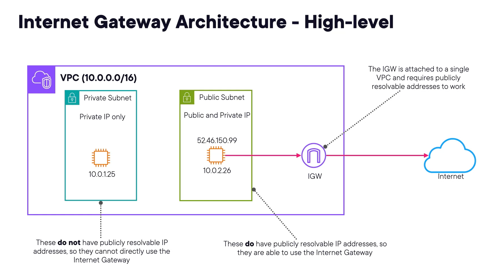
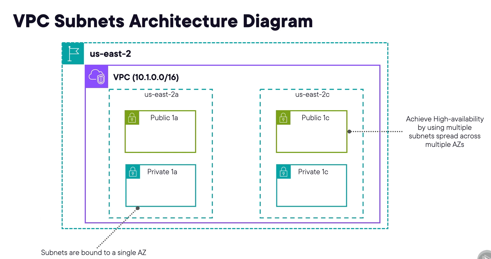
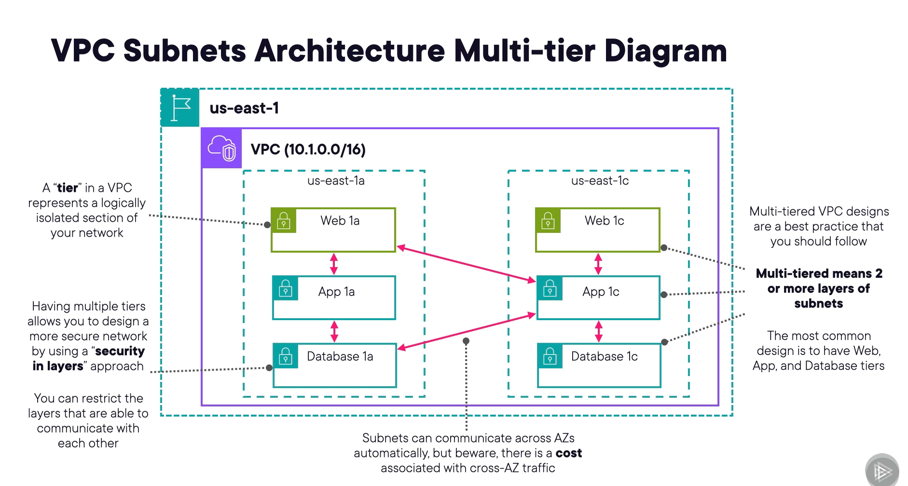
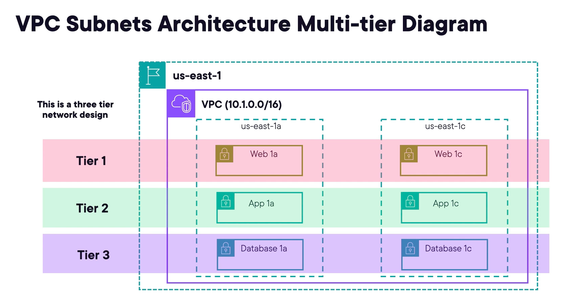
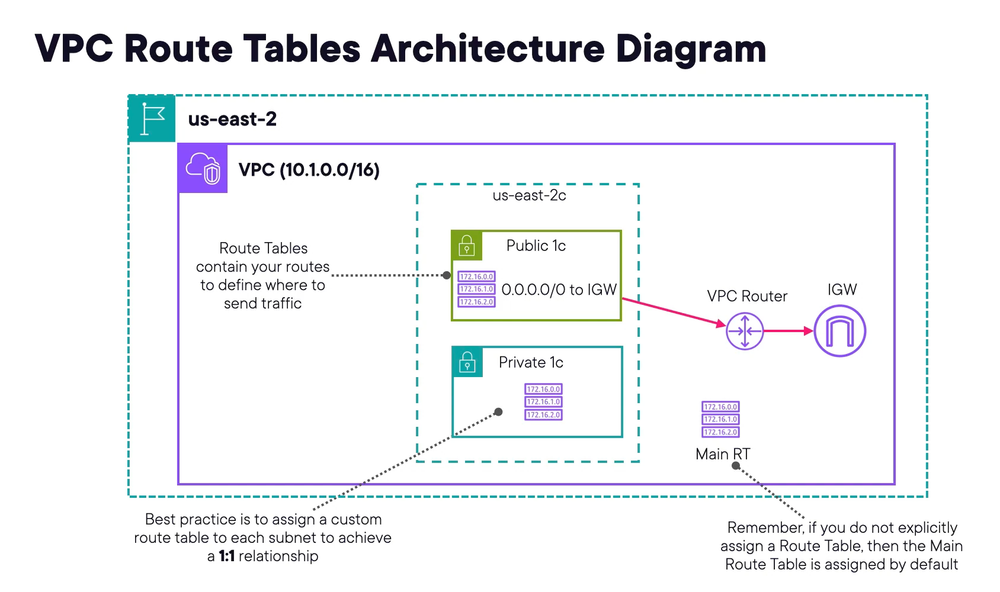
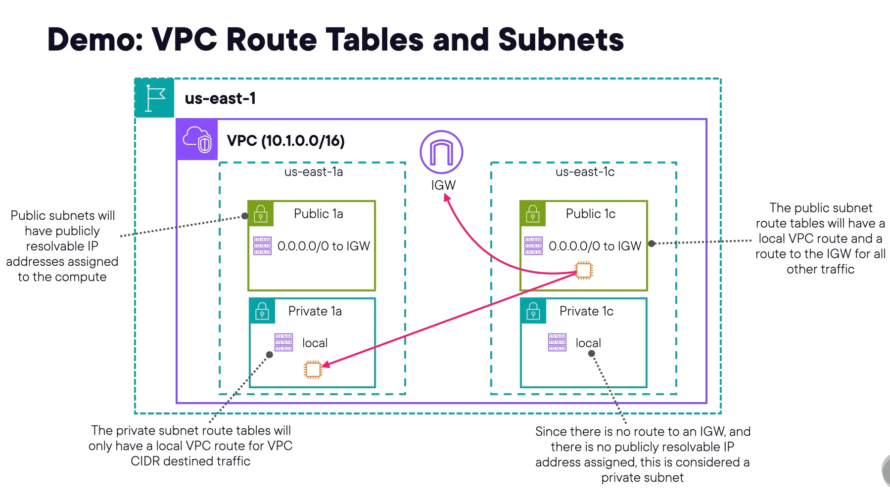
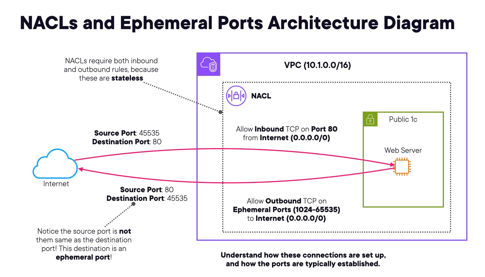
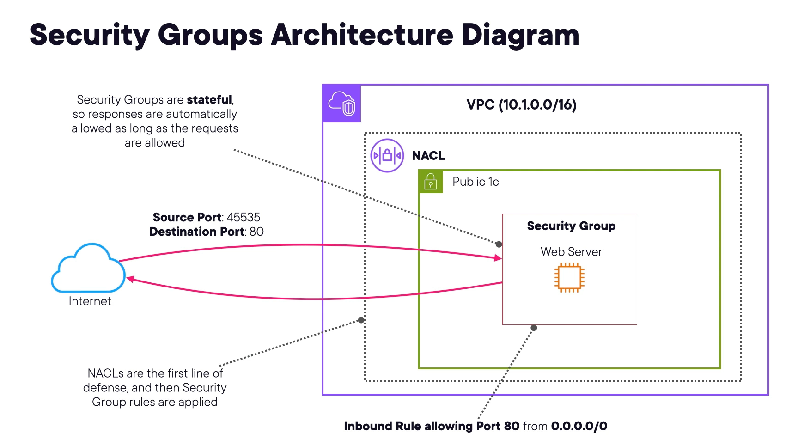
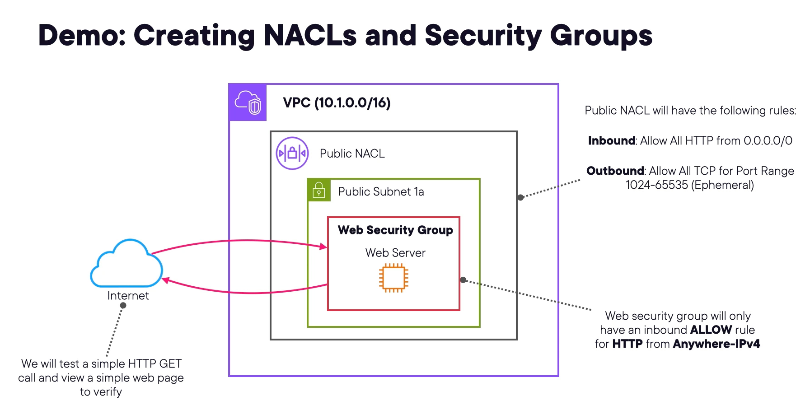

# 1- VPC Internet Gateways

## Sujet du cours

Présentation des **Internet Gateways (IGW)** dans AWS : leur rôle, leur fonctionnement et les règles essentielles à connaître pour l'examen.

---

## Concepts clés

- **Internet Gateway (IGW)** : composant VPC hautement disponible et redondant permettant la communication entre le VPC et Internet.
- **Horizontalement scalable** : s'adapte automatiquement à la charge sans configuration supplémentaire.
- **Haute disponibilité** : garantie au niveau régional par AWS.

---

## Explications essentielles

### Fonctionnement
- Fournit une **cible dans la route table** vers laquelle rediriger le trafic Internet.
- Tout trafic à destination d'Internet (ex. `0.0.0.0/0`) est routé via l'IGW.
- Seules les ressources avec une **adresse IP publique** (publiquement résolvable) peuvent utiliser directement un IGW.

### Règles importantes
- Supporte **IPv4 et IPv6**.
- Créé **séparément** du VPC custom — doit être attaché manuellement.
- Attachable à **un seul VPC à la fois** — non partageable entre VPCs.
- Dans le **VPC par défaut** : IGW créé et attaché automatiquement.

---

## Architecture de référence

```
VPC
├── Subnet privé                    Subnet public
│   └── EC2 (IP privée seulement)   └── EC2 (IP privée + IP publique)
│         ✗ Pas d'accès Internet          ✅ Accès Internet via IGW
│
└──────────────────────────── Internet Gateway ──▶ Internet
```

- **Subnet public** : instances avec IP publique → accès direct via IGW.
- **Subnet privé** : instances sans IP publique → **ne peuvent pas** utiliser directement l'IGW.

---

## Points à retenir

- Un IGW est **obligatoire** pour qu'un subnet public accède à Internet.
- **Condition absolue** : l'instance doit avoir une **IP publique** pour utiliser un IGW directement.
- Un IGW ne peut être attaché qu'à **un seul VPC** à la fois.
- Pour les instances privées souhaitant accéder à Internet → solution différente (NAT Gateway — module ultérieur).

# 2- VPC Subnets

## Sujet du cours

Présentation approfondie des **subnets VPC** : types, adresses réservées, conception d'architectures public/privé et designs multi-tiers.

---

## Concepts clés

| Concept          | Détail                                                                |
|------------------|-----------------------------------------------------------------------|
| **Subnet**       | Plage d'IPs dans un VPC pour héberger des ressources.                 |
| **Lié à une AZ** | Un subnet ne peut pas s'étendre sur plusieurs zones de disponibilité. |
| **Support IP**   | IPv4, IPv6 ou dual stack (les deux simultanément).                    |

---

## Types de subnets

| Type         | Description                                                                    |
|--------------|--------------------------------------------------------------------------------|
| **Public**   | Route directe vers Internet via un IGW, IPs publiques.                         |
| **Privé**    | Pas d'accès direct à Internet, IPs privées uniquement, nécessite un NAT.       |
| **VPN-only** | Accessible uniquement via VPN (couvert dans un module ultérieur).              |
| **Isolé**    | Aucune connectivité réseau — pour les ressources critiques sans besoin réseau. |

---

## Adresses IP réservées par AWS (5 par subnet)

Pour un subnet `10.0.0.0/24` :

| Adresse      | Usage                                           |
|--------------|-------------------------------------------------|
| `10.0.0.0`   | Adresse réseau                                  |
| `10.0.0.1`   | Routeur VPC                                     |
| `10.0.0.2`   | Serveur DNS Amazon (+2 address)                 |
| `10.0.0.3`   | Usage futur (réservé)                           |
| `10.0.0.255` | Adresse broadcast (non supportée dans les VPCs) |

> **Impact sur le calcul CIDR :** toujours soustraire 5 au nombre d'IPs calculé.
> Exemple `/28` : 16 − 5 = **11 IPs utilisables** (et non 16).

Les deux plus importantes à retenir : **routeur VPC** et **serveur DNS**.

---

## Architecture subnet — Bonne pratique

```
Région AWS
└── VPC
    ├── AZ us-east-2a                    AZ us-east-2c
    │   ├── Subnet Public (Tier 1)        ├── Subnet Public (Tier 1)
    │   ├── Subnet Privé App (Tier 2)     ├── Subnet Privé App (Tier 2)
    │   └── Subnet Privé DB (Tier 3)      └── Subnet Privé DB (Tier 3)
```

- Chaque subnet est **lié à une seule AZ**.
- Déployer sur **plusieurs AZs** pour assurer la haute disponibilité.
- Les subnets peuvent communiquer entre AZs automatiquement via le routage.
- ⚠️ **Coût** associé au trafic **cross-AZ et cross-région**.

---

## Design multi-tiers (best practice)

Un design multi-tiers divise le VPC en **sections logiquement isolées** (tiers), chacune représentant une couche fonctionnelle de l'architecture. L'objectif est d'appliquer le principe de **sécurité en couches** : si un attaquant pénètre une couche, il reste bloqué par les suivantes.

### Architecture typique à 3 tiers

```
Internet
    │
    ▼
┌─────────────────────────────────────┐
│  Tier 1 — Web (Public)              │
│  - Subnets publics (multi-AZ)       │
│  - Load Balancer, serveurs web      │
│  - Accessible depuis Internet       │
└──────────────┬──────────────────────┘
               │ Trafic autorisé depuis Tier 1
               ▼
┌──────────────────────────────────────┐
│  Tier 2 — Application (Privé)        │
│  - Subnets privés (multi-AZ)         │
│  - Serveurs d'application, API       │
│  - Accessible depuis Tier 1 seulement│
└──────────────┬───────────────────────┘
               │ Trafic autorisé depuis Tier 2
               ▼
┌──────────────────────────────────────┐
│  Tier 3 — Base de données (Privé)    │
│  - Subnets privés (multi-AZ)         │
│  - RDS, DynamoDB, etc.               │
│  - Accessible depuis Tier 2 seulement│
└──────────────────────────────────────┘
```

### Détail de chaque tier


| Tier                         | Type   | Ressources typiques                | Règle de trafic                         |
|------------------------------|--------|------------------------------------|-----------------------------------------|
| **Tier 1 — Web**             | Public | Load Balancer, serveurs web, CDN   | Ouvert à Internet (HTTP/HTTPS)          |
| **Tier 2 — Application**     | Privé  | Serveurs d'app, microservices, API | Trafic entrant depuis Tier 1 uniquement |
| **Tier 3 — Base de données** | Privé  | RDS, ElastiCache, DynamoDB         | Trafic entrant depuis Tier 2 uniquement |

### Pourquoi ce design ?
- **Isolation des responsabilités** : chaque tier a un rôle précis et limité.
- **Réduction de la surface d'attaque** : la base de données n'est jamais exposée directement à Internet.
- **Conformité** : les données sensibles (Tier 3) sont protégées par plusieurs couches de sécurité.
- **Scalabilité indépendante** : chaque tier peut être dimensionné séparément selon la charge.

### Contrôle du trafic entre tiers
Le trafic entre tiers est contrôlé via :
- **Security Groups** : règles au niveau de chaque instance (ex. Tier 2 n'accepte que le trafic du Security Group de Tier 1).
- **NACLs** : règles au niveau du subnet pour filtrage supplémentaire.

> Minimum recommandé : **2 tiers** dans tout VPC de production.
> Best practice : **3 tiers** pour toute application avec une base de données.

---

## Points à retenir

- Un subnet est **toujours lié à une seule AZ** — point fréquent à l'examen.
- AWS réserve **5 adresses IP par subnet** — à déduire du calcul CIDR.
- **Subnet public** = route vers IGW + IP publique. **Subnet privé** = pas de route IGW, nécessite NAT.
- Les architectures **multi-tiers** sont une best practice incontournable pour la sécurité et la résilience.
- VPCs ne supportent **pas le broadcast** — l'adresse broadcast est réservée, mais inutilisable.

# 3- VPC Route Tables

## Sujet du cours

Présentation des **tables de routage VPC** : leur rôle, leurs composants, les types de route tables et leur fonctionnement avec les subnets.

---

## Concepts clés

| Concept         | Description                                                                              |
|-----------------|------------------------------------------------------------------------------------------|
| **Route table** | Ressource VPC contenant des règles (routes) qui dirigent le trafic réseau.               |
| **Destination** | Plage d'IPs vers laquelle le trafic doit être dirigé (ex. `0.0.0.0/0` = tout le trafic). |
| **Target**      | Passerelle ou interface réseau vers laquelle envoyer le trafic (ex. Internet Gateway).   |
| **Local route** | Route non supprimable, présente par défaut — gère le trafic interne au VPC.              |
| **Association** | Lien entre un subnet et une route table — applique les règles au trafic du subnet.       |

---

## Types de route tables

| Type                   | Description                                                                                                      |
|------------------------|------------------------------------------------------------------------------------------------------------------|
| **Main route table**   | Créée automatiquement avec le VPC. Appliquée par défaut à tout subnet sans association explicite.                |
| **Custom route table** | Créée manuellement. Règles entièrement définies par l'utilisateur. Associée explicitement aux subnets souhaités. |

> **Règle importante** : si aucune route table n'est associée à un subnet, la **main route table s'applique automatiquement**.

---

## Explications essentielles

### Fonctionnement
1. Le **VPC router** (IP réservée dans chaque subnet) consulte la route table associée.
2. Il compare la destination du trafic aux règles définies.
3. Il envoie le trafic vers la **target** correspondante.

### Exemple de route table pour un subnet public

| Destination   | Target         | Rôle                                    |
|---------------|----------------|-----------------------------------------|
| `10.0.0.0/16` | `local`        | Trafic interne au VPC (non supprimable) |
| `0.0.0.0/0`   | `igw-xxxxxxxx` | Tout autre trafic → Internet Gateway    |

### Bonne pratique : relation 1:1 subnet/route table
- Associer **une route table par subnet** pour un contrôle granulaire du routage.
- Facilite la mise en place de règles strictes et améliore la sécurité.

---

## Architecture de référence

```
VPC
└── AZ us-east-2a
    ├── Subnet Public
    │   ├── VPC Router (IP réservée)
    │   └── Route table custom :
    │       ├── 10.0.0.0/16 → local
    │       └── 0.0.0.0/0  → Internet Gateway ──▶ Internet
    │
    └── Subnet Privé
        ├── VPC Router (IP réservée)
        └── Route table custom :
            └── 10.0.0.0/16 → local (trafic interne uniquement)
```

---

## Points à retenir

- La **main route table** est un filet de sécurité par défaut — ne pas s'y fier pour la production.
- La **local route est immuable** — toujours présente, impossible à supprimer.
- **Destination `0.0.0.0/0` + target IGW** = règle classique pour un subnet public avec accès Internet.
- Toujours **associer explicitement** une custom route table à chaque subnet (best practice 1:1).
- Sans association explicite → **main route table appliquée automatiquement**.

# 4- Demo: VPC Route Tables and Subnets

## Sujet du cours

Démonstration complète de la création d'une infrastructure VPC : **Internet Gateway, subnets public/privé, route tables custom** et vérification du routage via des instances EC2.

---

## Architecture déployée

```
VPC (10.1.0.0/16)
├── Internet Gateway (attaché au VPC)
│
├── AZ us-east-1a
│   ├── private_subnet_1a  (10.1.0.0/24) → private_rt_1a  (local uniquement)
│   └── public_subnet_1a   (10.1.1.0/24) → public_rt_1a   (local + IGW)
│
└── AZ us-east-1c
    ├── private_subnet_1c  (10.1.2.0/24) → private_rt_1c  (local uniquement)
    └── public_subnet_1c   (10.1.3.0/24) → public_rt_1c   (local + IGW)
```

---

## Méthodes / Raisonnements

### 1. Créer et attacher l'Internet Gateway
1. VPC → **Internet Gateways** → *Create internet gateway*.
2. Après création : **Actions** → *Attach to VPC* → sélectionner le VPC custom.
> Un IGW créé est en état *detached* par défaut — il doit être attaché manuellement.

### 2. Créer les subnets (x4)
- 2 subnets privés (convention : adresses **paires** — `.0`, `.2`)
- 2 subnets publics (convention : adresses **impaires** — `.1`, `.3`)
- Chaque subnet est lié à une **AZ spécifique**.

| Subnet            | AZ         | CIDR          | IPs disponibles         |
|-------------------|------------|---------------|-------------------------|
| private_subnet_1a | us-east-1a | `10.1.0.0/24` | 251 (256 − 5 réservées) |
| private_subnet_1c | us-east-1c | `10.1.2.0/24` | 251                     |
| public_subnet_1a  | us-east-1a | `10.1.1.0/24` | 251                     |
| public_subnet_1c  | us-east-1c | `10.1.3.0/24` | 251                     |

### 3. Créer les route tables (1:1 avec chaque subnet)
1. Créer 4 route tables : `private_rt_1a`, `private_rt_1c`, `public_rt_1a`, `public_rt_1c`.
2. **Associer chaque route table** à son subnet correspondant (*Edit subnet associations*).

### 4. Configurer les routes

**Route tables privées** (local uniquement) :
| Destination   | Target  |
|---------------|---------|
| `10.1.0.0/16` | `local` |

**Route tables publiques** (local + Internet) :
| Destination   | Target         |
|---------------|----------------|
| `10.1.0.0/16` | `local`        |
| `0.0.0.0/0`   | `igw-xxxxxxxx` |

### 5. Tester avec des instances EC2

**Instance publique** (dans `public_subnet_1c`) :
- IP publique activée → reçoit une IP publique ET une IP privée.
- Test : `traceroute pluralsight.com` → ✅ trafic routé via l'IGW vers Internet.

**Instance privée** (dans `private_subnet_1a`) :
- IP publique désactivée → IP privée uniquement.
- Test depuis l'instance publique : `ping <IP_privée>` → ✅ communication interne via la local route.
- Test Internet depuis le subnet privé → ❌ pas de route IGW = pas d'accès Internet.

---

## Points à retenir

- **Convention de nommage** : inclure l'AZ dans le nom du subnet pour une identification rapide.
- **251 IPs disponibles** pour un `/24` dans AWS (256 − 5 réservées par AWS).
- Un subnet sans association explicite utilise la **main route table** par défaut — à éviter en production.
- Les deux conditions d'un subnet **vraiment public** : route vers IGW + IP publique sur les ressources.
- Les instances dans des subnets différents peuvent communiquer via la **local route** (même VPC).

# 5- Network Access Control Lists (NACLs)

## Sujet du cours

Présentation des **Network Access Control Lists (NACLs)** : pare-feux stateless au niveau subnet, leurs règles, leurs limites et le concept critique des **ports éphémères**.

---

## Concepts clés

| Concept               | Détail                                                                                             |
|-----------------------|----------------------------------------------------------------------------------------------------|
| **NACL**              | Pare-feu stateless contrôlant le trafic entrant et sortant **au niveau du subnet**.                |
| **Stateless**         | Les règles inbound et outbound sont **indépendantes** — doivent être définies séparément.          |
| **1 NACL par subnet** | Un subnet ne peut avoir qu'une seule NACL associée.                                                |
| **Règles numérotées** | Priorité par ordre croissant — **la première règle correspondante gagne**, le traitement s'arrête. |
| **NACL par défaut**   | Autorise tout le trafic entrant et sortant (à remplacer par une NACL custom).                      |
| **NACL custom**       | **Refuse tout le trafic par défaut** — chaque règle doit être explicitement définie.               |

---

## Explications essentielles

### Fonctionnement stateless
Contrairement à un pare-feu stateful, un NACL ne "se souvient" pas des connexions. Il faut donc définir **deux règles pour chaque flux** :
- Une règle **inbound** pour le trafic entrant.
- Une règle **outbound** pour le trafic sortant (réponse).

### Trafic non filtrable par les NACLs
Les NACLs ne peuvent pas filtrer :
- Le **DNS Amazon** (Amazon-provided DNS).
- Le trafic **DHCP Amazon**.
- Les **métadonnées d'instance EC2**.
- Les **adresses IP réservées** du routeur VPC par défaut.

---

## Ports éphémères — Point critique pour l'examen

Un **port éphémère** est un port temporaire côté client, alloué aléatoirement par l'OS pour une connexion sortante.

- Plage : **1024 – 65535**
- Varie selon l'OS, mais toujours dans cette plage.

### Exemple : connexion HTTP entrante

```
Client (Internet)                    Serveur Web (EC2)
Port source : 45535 (éphémère)  ──▶  Port destination : 80
Port destination : 80           ◀──  Port source : 80 → réponse sur port éphémère 45535
```

**Règles NACL nécessaires :**

| Direction    | Protocole | Port       | Source/Destination     |
|--------------|-----------|------------|------------------------|
| **Inbound**  | TCP       | 80         | `0.0.0.0/0` (Internet) |
| **Outbound** | TCP       | 1024–65535 | `0.0.0.0/0` (Internet) |

> ⚠️ Erreur fréquente : oublier la règle outbound sur les ports éphémères en pensant que "autoriser le port 80 entrant suffit".

---

## Architecture de référence

```
Internet
    │  TCP port 80 (inbound) ✅
    ▼
┌──────────────────────────────┐
│  NACL (subnet public)        │
│  Inbound  : TCP 80  ✅       │
│  Outbound : TCP 1024-65535 ✅│
└──────────────────────────────┘
    │
    ▼
Subnet Public → EC2 (serveur web)
    │  TCP port éphémère (outbound) ✅
    ▼
Internet (réponse vers le client)
```

---

## Points à retenir

- NACLs = **pare-feu stateless au niveau subnet** — à ne pas confondre avec les Security Groups (stateful, niveau instance).
- **Toujours définir les règles inbound ET outbound** séparément.
- **Première règle correspondante = règle appliquée** — l'ordre des règles est critique.
- Une NACL custom **refuse tout par défaut** — penser à ajouter les règles nécessaires.
- **Ports éphémères (1024–65535)** : toujours inclure cette plage dans les règles outbound pour les réponses. Point fréquemment testé à l'examen.

# 6- Security Groups

## Sujet du cours

Présentation des **Security Groups** : pare-feux virtuels stateful attachés au niveau des ressources EC2, leur fonctionnement et leur différence fondamentale avec les NACLs.

---

## Concepts clés

| Concept                     | Détail                                                                                                          |
|-----------------------------|-----------------------------------------------------------------------------------------------------------------|
| **Security Group**          | Pare-feu virtuel **stateful** contrôlant le trafic entrant et sortant d'une ressource.                          |
| **Stateful**                | Une connexion autorisée dans un sens est **automatiquement autorisée** dans l'autre sens.                       |
| **Niveau d'application**    | Attaché à une **instance EC2 ou une interface réseau** (pas au subnet).                                         |
| **Règles allow uniquement** | Pas de règles deny — tout ce qui n'est pas explicitement autorisé est **implicitement refusé**.                 |
| **Évaluation des règles**   | **Toutes les règles sont évaluées** avant application — la règle la plus restrictive qui correspond s'applique. |

---

## Composants d'une règle Security Group

| Composant                | Description                                               |
|--------------------------|-----------------------------------------------------------|
| **Protocole**            | TCP, UDP, ICMP, etc.                                      |
| **Port range**           | Port ou plage de ports autorisés (ex. 80, 443, 22).       |
| **Source / Destination** | Plage d'IPs ou **ID d'un autre Security Group** autorisé. |

> **Pro tip examen** : on peut référencer l'**ID d'un autre Security Group** comme source/destination — plus flexible et maintenable que de gérer des plages d'IPs.

---

## NACLs vs Security Groups — Comparaison

| Critère         | NACL                          | Security Group                     |
|-----------------|-------------------------------|------------------------------------|
| **Type**        | Stateless                     | Stateful                           |
| **Niveau**      | Subnet                        | Instance / Interface réseau        |
| **Règles deny** | ✅ Oui                        | ❌ Non (deny implicite uniquement) |
| **Évaluation**  | Première règle correspondante | Toutes les règles évaluées         |
| **Réponses**    | Règle outbound requise        | Automatiquement autorisées         |

---

## Fonctionnement stateful — Exemple

**Règle inbound définie :**
```
Inbound : TCP port 80 depuis 0.0.0.0/0 ✅
```

**Résultat automatique (stateful) :**
```
→ Requête HTTP entrante (port 80)     ✅ autorisée par la règle
← Réponse HTTP sortante (port éphémère) ✅ automatiquement autorisée
```
> Pas besoin de définir une règle outbound pour la réponse — contrairement aux NACLs.

---

## Architecture de référence

```
Internet
    │
    ▼
┌─────────────────────────────┐
│  NACL (niveau subnet)       │  ← 1ère ligne de défense
└──────────────┬──────────────┘
               │
               ▼
┌─────────────────────────────┐
│  Security Group (niveau EC2)│  ← 2ème ligne de défense
│  Inbound : TCP 80 ✅        │
│  (outbound réponse : auto)  │
└──────────────┬──────────────┘
               │
               ▼
         EC2 (serveur web)
```

---

## Points à retenir

- Security Groups = **stateful** / NACLs = **stateless** — distinction critique pour l'examen.
- Security Groups s'appliquent au **niveau ressource**, NACLs au **niveau subnet**.
- **Pas de règle deny** dans un Security Group — deny implicite pour tout ce qui n'est pas autorisé.
- Référencer des **Security Group IDs** dans les règles évite de gérer des IPs — bonne pratique.
- NACLs et Security Groups fonctionnent en **couches complémentaires** : NACL filtre d'abord, Security Group ensuite.

# 7- Demo: Creating NACLs and Security Groups

## Sujet du cours

Démonstration complète de la création d'un **NACL public** et d'un **Security Group web**, leur association à un subnet et une instance EC2, et la vérification du filtrage du trafic en conditions réelles.

---

## Architecture déployée

```
Internet
    │  HTTP port 80
    ▼
┌──────────────────────────────────────────┐
│  NACL public (niveau subnet)             │
│  Inbound  : TCP 80 depuis 0.0.0.0/0 ✅   │
│  Outbound : TCP 1024-65535 vers tout ✅  │
└──────────────────┬───────────────────────┘
                   │
                   ▼
┌──────────────────────────────────────────┐
│  Security Group web (niveau EC2)         │
│  Inbound  : HTTP 80 depuis 0.0.0.0/0 ✅  │
│  Outbound : tout (par défaut) ✅         │
└──────────────────┬───────────────────────┘
                   │
                   ▼
            EC2 (serveur web Apache)
```

---

## Méthodes / Raisonnements

### 1. Créer le NACL public
1. VPC → **Network ACLs** → *Create network ACL*.
2. Nommer et associer au VPC cible.
3. **Règle inbound** (stateless → obligatoire) :
    - Règle n° 100 | Type : HTTP | Port : 80 | Source : `0.0.0.0/0` | Allow
4. **Règle outbound** (stateless → obligatoire) :
    - Règle n° 100 | Type : Custom TCP | Port range : `1024–65535` | Destination : `0.0.0.0/0` | Allow
5. **Associer le subnet** : *Edit subnet associations* → sélectionner le subnet public.

> ⚠️ Un NACL nouvellement créé **refuse tout le trafic par défaut** — les deux règles sont indispensables.

### 2. Créer le Security Group web
1. VPC → **Security Groups** → *Create security group*.
2. Nommer, décrire et **sélectionner le VPC** (les Security Groups sont liés à un VPC).
3. **Règle inbound** :
    - Type : HTTP | Port : 80 | Source : Anywhere IPv4 (`0.0.0.0/0`)
4. Laisser la **règle outbound par défaut** (tout autoriser) — le stateful gère les réponses automatiquement.

> Par défaut : **tout le trafic outbound est autorisé**. Seules les règles **allow** existent — pas de règle deny.

### 3. Lancer l'instance EC2 (serveur web)
1. EC2 → *Launch instance* → sélectionner une AMI avec Apache.
2. Network settings : **VPC custom**, subnet public, **IP publique activée**.
3. Firewall : sélectionner le **Security Group web** créé.
4. User data : redémarrer le service Apache (`service httpd restart`).

### 4. Tester le filtrage NACL — Priorité des règles
- Ajout d'une règle n° **90** (avant la règle 100) : **deny** depuis une IP spécifique.
- Résultat : la connexion HTTP depuis cette IP est bloquée — la règle 90 est évaluée avant la règle 100 et s'applique.
- Démontre que **la première règle correspondante gagne** et que le traitement s'arrête.

---

## Points à retenir

- **NACL stateless** : toujours définir les règles inbound ET outbound séparément.
- **Ports éphémères (1024–65535)** : obligatoires en outbound pour autoriser les réponses HTTP.
- **Security Group stateful** : une règle inbound autorisée = réponse outbound automatiquement autorisée.
- Security Groups sont **liés à un VPC spécifique** — non partageables entre VPCs.
- L'ordre des règles NACL est critique : **numéro plus petit = priorité plus haute**.
- Les deux ressources fonctionnent en **couches complémentaires** : NACL → Security Group → EC2.


# 8- DHCP Option Sets

## Sujet du cours

Présentation des **DHCP Option Sets** dans AWS VPC : leur rôle, leur configuration, leurs règles d'association et la contrainte importante d'immutabilité.

---

## Concepts clés

| Concept                           | Détail                                                                      |
|-----------------------------------|-----------------------------------------------------------------------------|
| **DHCP Option Set**               | Groupe de paramètres réseau attribués aux ressources déployées dans un VPC. |
| **1 option set par VPC**          | Un VPC ne peut avoir qu'**un seul** DHCP option set associé à la fois.      |
| **1 option set → plusieurs VPCs** | Un même option set peut être associé à **plusieurs VPCs**.                  |
| **Immutable**                     | Un option set **ne peut pas être modifié** après création.                  |

---

## Paramètres configurables

- **Serveurs DNS** : définir les serveurs de résolution de noms à utiliser.
- **Nom de domaine** : personnaliser le domaine attribué aux instances.
- **Serveurs NTP** : spécifier des serveurs de temps personnalisés.
- **Résolution DNS** : activer ou désactiver la résolution DNS dans le VPC.

---

## Explications essentielles

### Comportement par défaut
- Chaque région AWS dispose de son propre **DHCP option set par défaut** créé à l'activation du compte.
- Chaque VPC utilise cet option set par défaut **sauf si un custom est explicitement associé**.

### Options disponibles
1. Utiliser le **DHCP option set par défaut** de la région.
2. Créer et associer un **custom option set**.
3. Spécifier **aucun DHCP option set** (rare, cas très spécifiques).

---

## Point critique — Immutabilité

> ⚠️ **Un DHCP option set ne peut jamais être modifié après sa création.**

**Procédure en cas de modification nécessaire :**
1. Créer un **nouvel option set** avec les paramètres mis à jour.
2. **Associer le nouvel option set** au VPC concerné.
3. L'ancien option set est remplacé.

---

## Points à retenir

- **1 VPC = 1 DHCP option set maximum** (mais 1 option set peut servir plusieurs VPCs).
- **Immutable** : impossible de modifier — toujours créer un nouvel option set et réassocier.
- Scénario examen fréquent : "modifier les paramètres DNS d'un VPC" → créer un **nouvel option set** et l'associer.

# 9- Demo: Creating a DHCP Option Set

## Sujet du cours

Démonstration pratique de la **création d'un DHCP option set personnalisé**, de son association à un VPC et de la vérification de son application sur une instance EC2.

---

## Méthodes / Raisonnements

### 1. Créer un DHCP option set custom
1. VPC → **DHCP option sets** → *Create DHCP option set*.
2. Configurer les paramètres souhaités :

| Paramètre               | Exemple utilisé      | Description                                 |
|-------------------------|----------------------|---------------------------------------------|
| **Domain name**         | `pluralsight.corp`   | Nom de domaine attribué aux instances       |
| **Domain name servers** | `1.1.1.1`, `8.8.8.8` | Serveurs DNS à utiliser pour la résolution  |
| **NTP servers**         | *(non configuré)*    | Serveurs de temps personnalisés (optionnel) |
| **NetBIOS servers**     | *(non configuré)*    | Serveurs NetBIOS (optionnel)                |

3. Cliquer sur *Create DHCP option set*.

> ⚠️ L'option set est créé mais **non associé** — il ne s'applique à aucun VPC tant qu'il n'est pas lié.

### 2. Associer l'option set au VPC
1. VPC → sélectionner le VPC cible → **Actions** → *Edit VPC settings*.
2. Sélectionner le nouvel option set (`production_dhcp`).
3. Sauvegarder — l'ancien option set est remplacé.

### 3. Vérifier l'application sur une instance EC2
Connecter à une instance via **Session Manager** et exécuter :

```bash
# Vérifier le hostname (domaine personnalisé)
hostname
# Résultat attendu : ip-10-x-x-x.pluralsight.corp

# Vérifier les serveurs DNS configurés
cat /etc/resolv.conf
# Résultat attendu :
# nameserver 1.1.1.1
# nameserver 8.8.8.8
# search pluralsight.corp
```

---

## Points à retenir

- Un option set **n'est pas actif** tant qu'il n'est pas associé à un VPC.
- **Impossible de modifier** un option set existant — créer un nouveau et réassocier.
- La vérification se fait via `hostname` (domaine) et `/etc/resolv.conf` (serveurs DNS) sur l'instance.
- Les nouveaux paramètres DHCP s'appliquent aux **nouvelles instances** lancées après l'association — les instances existantes peuvent nécessiter un renouvellement du bail DHCP.

# 10- Module Summary and Exam Tips — Subnets, Route Tables, NACLs, Security Groups & DHCP

## Sujet du cours

Récapitulatif complet des ressources VPC essentielles et conseils clés pour l'examen.

---

## Subnets — Rappels

- Plages d'IPs réservées dans un VPC, **liées à une seule AZ** (jamais multi-AZ).
- Supportent IPv4, IPv6 et **dual stack** (les deux simultanément).
- **1 subnet = 1 route table** maximum associée à la fois.
- **AWS réserve 5 adresses IP par subnet** → `/24` = 256 − 5 = **251 IPs utilisables**.

| Type       | IP                   | Route vers IGW  |
|------------|----------------------|-----------------|
| **Public** | IP publique + privée | ✅ Oui          |
| **Privé**  | IP privée uniquement | ❌ Non          |

---

## Route Tables — Rappels

- Contiennent des règles (**destination → target**) pour router le trafic.
- **Règle la plus spécifique (longest prefix match) gagne** en cas de chevauchement.
- **Main route table** : appliquée par défaut aux subnets sans association explicite.
- Une route table peut être associée à **plusieurs subnets** ; un subnet n'a qu'**une seule route table**.

| Terme           | Définition                                                  |
|-----------------|-------------------------------------------------------------|
| **Destination** | Plage d'IPs cible du trafic (ex. `0.0.0.0/0`)               |
| **Target**      | Passerelle utilisée pour atteindre la destination (ex. IGW) |

---

## NACLs vs Security Groups — Comparaison critique

| Critère                  | NACL                          | Security Group                      |
|--------------------------|-------------------------------|-------------------------------------|
| **Type**                 | Stateless                     | Stateful                            |
| **Niveau**               | Subnet                        | Instance EC2 / ENI                  |
| **Règles deny**          | ✅ Allow + Deny               | ❌ Allow uniquement                 |
| **Évaluation**           | Première règle correspondante | Toutes les règles évaluées          |
| **Réponses**             | Règle outbound requise        | Automatiquement autorisées          |
| **Nombre par ressource** | 1 NACL par subnet             | Plusieurs SG possibles par instance |

### Security Groups — Points clés
- **Stateful** : réponse automatiquement autorisée si la requête est autorisée.
- **Deny implicite** : tout ce qui n'est pas explicitement autorisé est refusé.
- Règles définies par : **source/destination + port range + protocole**.
- **Agrégation possible** : plusieurs Security Groups sur une instance → toutes les règles combinées, la plus restrictive gagne.
- **Pro tip** : référencer un **Security Group ID** comme source plutôt qu'une plage IP → plus maintenable.

### NACLs — Points clés
- **Stateless** : inbound et outbound **toujours définis séparément**.
- **Première règle correspondante gagne** — l'ordre des règles est critique.
- 1 seul NACL par subnet (mais 1 NACL peut être partagé entre plusieurs subnets).
- Ne filtrent pas : DNS Amazon, DHCP Amazon, métadonnées EC2, IPs réservées VPC.

---

## DHCP Option Sets — Rappel

- **Immutable** : impossible de modifier après création.
- Procédure de modification : créer un **nouvel option set** → **associer au VPC** → supprimer l'ancien.

---

## Conseils examen

- **Subnet lié à une AZ** → point fréquemment testé, ne jamais dire qu'un subnet peut s'étendre sur plusieurs AZs.
- **5 IPs réservées par subnet** → toujours soustraire 5 du calcul CIDR.
- **NACL vs Security Group** → la distinction stateless/stateful + subnet/instance est la question classique.
- **Ports éphémères (1024–65535)** → obligatoires en règle outbound NACL pour les réponses.
- **Security Group ID comme source** → best practice pour les règles inter-tiers (ex. app → db).
- **DHCP modifié** → toujours créer un nouveau et réassocier, jamais modifier en place.